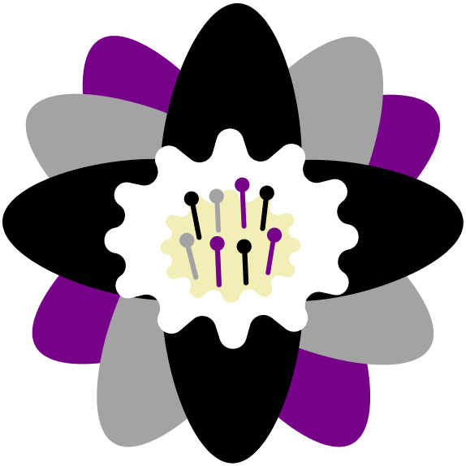
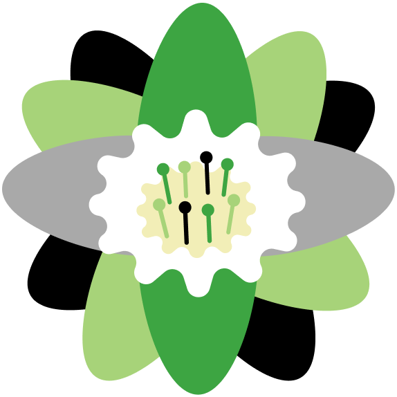
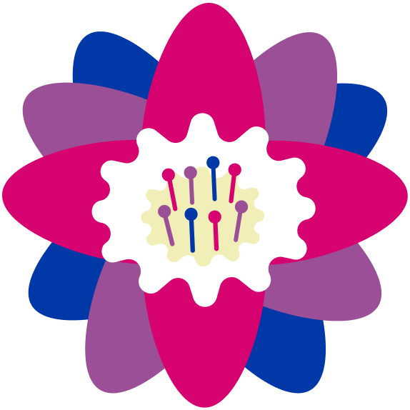
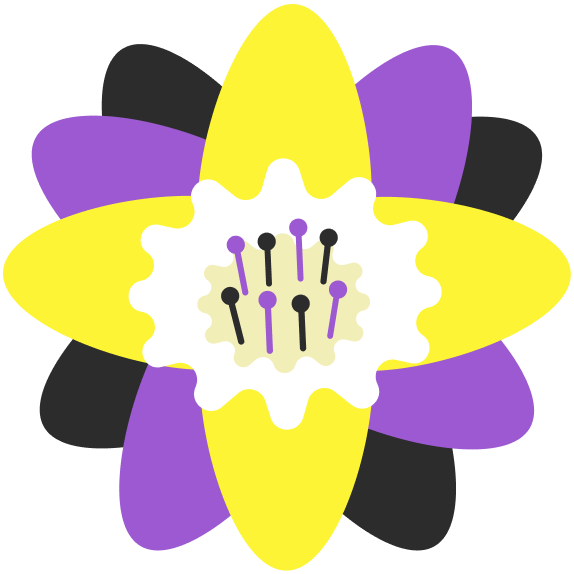
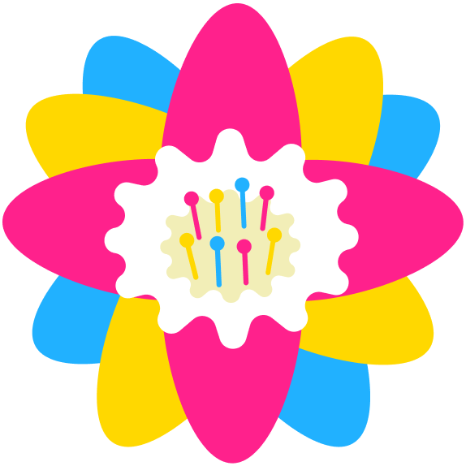
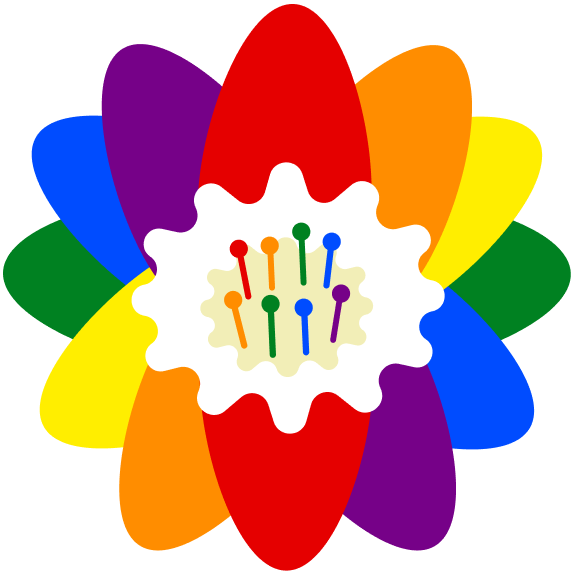
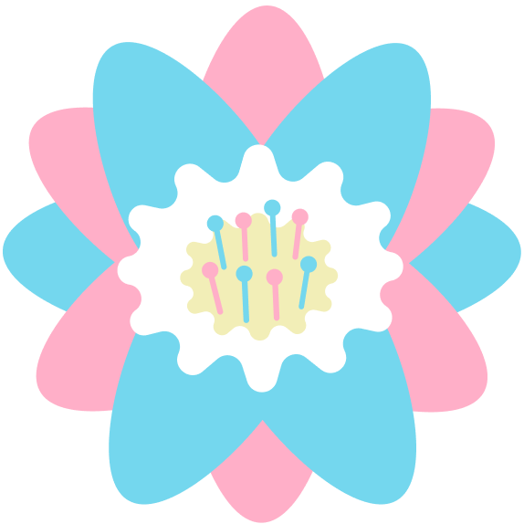

# Pride and ND lily emojis

This repo contains vector and PNGs of various pride coloured and ND themed lily emojis I made for Mastodon!

|Name|Preview|
|--|--|
|`ace_lily`||
|`adhd_lily`||
|`aro_lily`||
|`autistic_lily`||
|`bi_lily`||
|`lesbian_lily`||
|`nb_lily`||
|`pan_lily`||
|`rainbow_lily`||
|`trans_lily`||

_Made by [Maddie Lim](https://maddie.vision) using [Figma](https://figma.com)_

# License
The images are licensed under the [Creative Commons Attribution 4.0 International License](http://creativecommons.org/licenses/by/4.0/).
